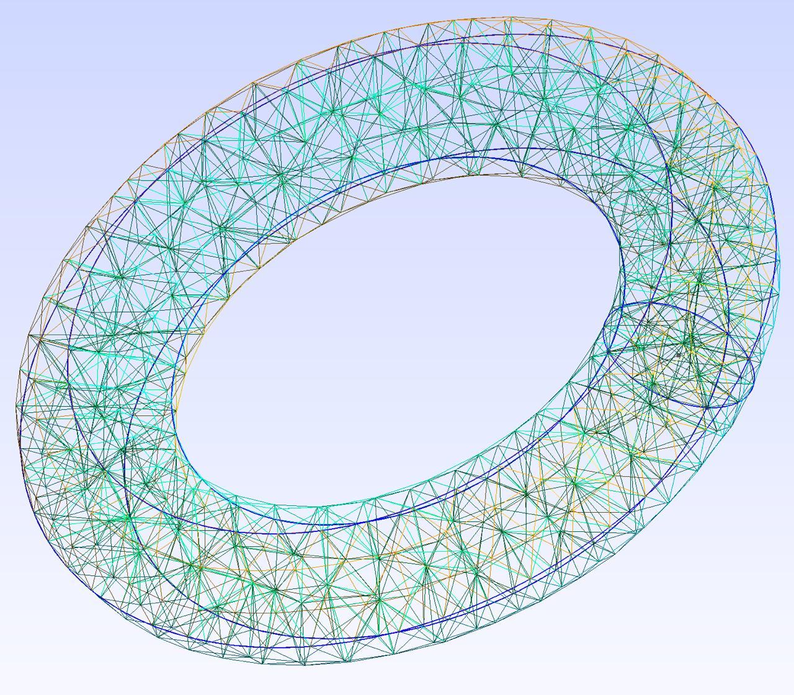
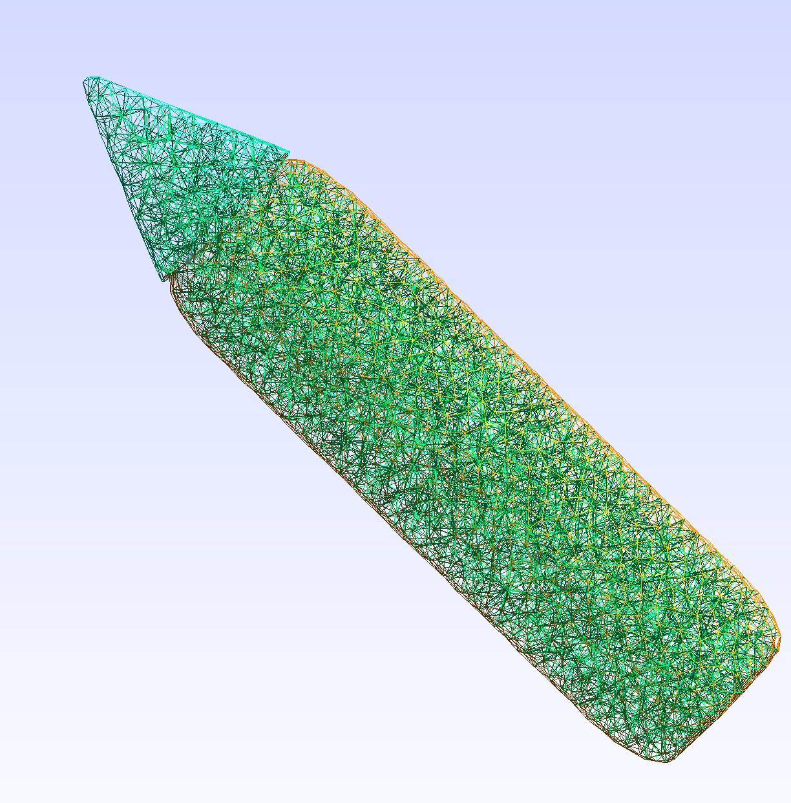
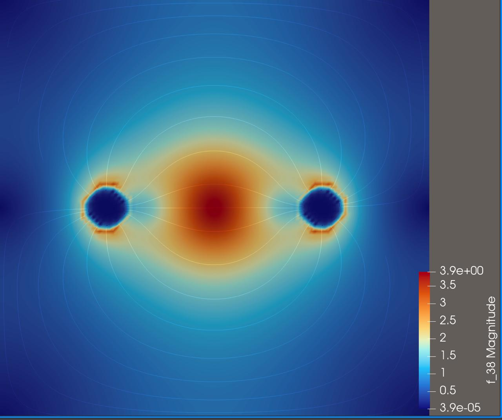

# Результаты лабораторных работ:

## Лаба 1.
### 1. Создание тора из примитивов и разбиение на сетку:

### 2. Разбиение STL на сетку:

## Лаба 2. Моделиривание удара по кончику карандаша

## Лаба 3. Диполь в неоднородной среде (FEniCS)

Диполь в неоднородной среде с гауссовой проводимостью.
Область низкой проводимости в центре экранирует поле между зарядами,
силовые линии огибают её сверху и снизу.

